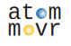

## A simulation framework for rearrangement in atomic arrays

by [Nikhil Kiran Harle*](https://github.com/khnikhil/khnikhil), [Bo-Yu Chen*](https://phys-mattchen.github.io/), [Bob Bao](https://www.bobbaothebuilder.com/#), and [Hannes Bernien](https://bernienlab.com).

*These authors contributed equally to this work

## Key features and `where to find them`


:books: Open-source library of rearrangement algorithms:   `atommovr.algorithms/`
:books: Open-source library of rearrangement algorithms:   `atommovr.algorithms/`

:movie_camera: Visualization of rearrangement process: `atommovr.utils.animation.py`
:movie_camera: Visualization of rearrangement process: `atommovr.utils.animation.py`

:computer: Experimentally-relevant error modeling: `atommovr.utils.ErrorModel.py`
:computer: Experimentally-relevant error modeling: `atommovr.utils.ErrorModel.py`

:chart_with_upwards_trend: Flexible benchmarking suite for running experiments: `atommovr.utils.benchmarking.py`
:chart_with_upwards_trend: Flexible benchmarking suite for running experiments: `atommovr.utils.benchmarking.py`

:toolbox: Core utils for moving atoms and simulating stochastic loading: `atommovr.utils.core.py` and `atommovr.utils.move_utils.py`

:camera: Realistic imaging pipeline: `atommovr.utils.imaging/` - Generate camera-like images from atom grids, extract centroids with blob detection, estimate grid angles, and fit detected atoms back to grids.

:wrench: AWG hardware controller: `awg_controller/` - Drive Spectrum Instrumentation DDS cards with four interchangeable execution strategies (streaming, ramp, pattern, camera-triggered).

:test_tube: Comprehensive test suites: `atommovr.tests/` and `awg_controller/tests/` - Unit and integration tests covering algorithms, imaging, RF conversion, and DDS strategies.

:gear: Imaging parameter optimization: `optimization/` - Automated search for blob-detection parameters such as sigma bounds and detection thresholds.


# Use

## Getting started
Want to learn how to use this code? Curious about what it means to be an atom mover?  Head on over to [`tutorial.ipynb`](tutorial.ipynb).

Want to reproduce the figures from our paper? Check out [`paper_figures.ipynb`](paper_figures.ipynb).

Want to add an algorithm to the library, or make your own? Check out our template in [`atommovr.algorithms.Algorithm.py`](/atommovr/algorithms/Algorithm.py).
Want to add an algorithm to the library, or make your own? Check out our template in [`atommovr.algorithms.Algorithm.py`](/atommovr/algorithms/Algorithm.py).

Want to add some features and/or make this code nicer? Check out [`CONTRIBUTING.md`](CONTRIBUTING.md).


## Imaging Pipeline Quick Start

The new `atommovr.utils.imaging` subpackage provides realistic image synthesis and extraction:

```python
from atommovr.utils.AtomArray import AtomArray
from atommovr.utils.imaging import extract_estimate_rotate_and_assign

# Generate realistic camera image from atom array
arr = AtomArray(shape=[6, 8], n_species=1)
arr.load_tweezers()  
img = arr.render_realistic_image(sigma=1.5, image_shape=(128, 128))

# Extract grid from image with angle correction
binary_grid, angle_deg, n_centroids = extract_estimate_rotate_and_assign(
    img, grid_shape=(6, 8), 
    method='blob',      # OpenCVs BlobDetection
    angle_method='pca'  # multiple angle estimation options
)
print(f"Detected {binary_grid.sum()} atoms at {angle_deg:.1f}° rotation")
```

See [`imaging_demo.py`](imaging_demo.py) for complete examples.

##  Installation

To make the virtual environment, navigate to the main folder and run the following command in Terminal/Powershell: 
```
conda env create -f environment.yml
```

# Acknowledgments

## Collaborators and discussions

We gratefully thank Shraddha Anand, Will Eckner, Noah Glachman, Andy Goldschmidt, Kevin Singh, Mariesa Teo, and Nayana Tiwari.

## External code
- [bottled](https://gitlab.inria.fr/bora-ucar/bottled): (copied into [`\PPSU2023`](/PPSU2023/README.md))
  - Authors: Ioannis Panagiotas, Grégoire Pichon, Somesh Singh, Bora Uçar. 
  - Reference: *Engineering fast algorithms for the bottleneck matching problem.* ESA 2023 - The 31st Annual European Symposium on Algorithms, Sep 2023, Amsterdam (Hollande), Netherlands. [⟨hal-04146298v2⟩](https://inria.hal.science/hal-04146298v2)

## Funding sources
* Office of Naval Research (Grant No. N00014-23-1-2540)
* Air Force Office of Scientific Research (Grant No. FA9550-21-1-0209)
* Army Research Office (Grant no. W911NF2410388) 
* Nikhil acknowledges support from the National Science Foundation Graduate Research Fellowship (Grant No. DGE-2040434) 
* Bo-Yu acknowledges support from the UChicago-Taiwan Student Exchange (UCTS) fellowship, National Taiwan University Fu Bell Scholarship, National Taiwan University College of Science Travel Grants and Chuan-Pu Lee Memorial Scholarship.

## Citation
```
@article{HCBB2025atommovr,
  title={atommovr: An open-source simulation framework for rearrangement in atomic arrays},
  author={Nikhil K. Harle and Bo-Yu Chen and Bob Bao and Hannes Bernien},
  journal={arXiv preprint arXiv:2508:02670},
  year={2025}
}
```

Correspondence and request for materials should be directed to [Hannes Bernien](hannes.bernien@uibk.ac.at).
