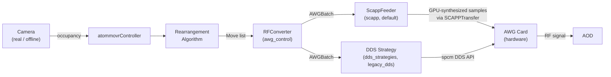

# AWG Controller

Hardware control package for driving a Spectrum Instrumentation AWG card
during atom rearrangement.

## Overview

Isolates AWG control from the `atommovr` simulation framework. Logical atom
moves become RF frequency commands that drive acousto-optic deflectors
(AODs), through one of two interchangeable **backends**:

- **`scapp`** (default) — GPU-direct RDMA generation. A background thread
  continuously synthesizes multi-tone drive waveforms on the GPU (CuPy) and
  streams them to the card via `spcm.SCAPPTransfer`. No fixed tone-count
  ceiling; frequency ramps are smooth (linear or S-curve) by construction.
- **`legacy_dds`** — the original DDS core-register approach
  (`dds_strategies.py`), kept as an opt-in alternative with its four
  interchangeable strategies (`streaming`/`ramp`/`pattern`/`camera_triggered`).

Both backends open a single card (multi-card support has been removed — it
only ever broadcast identical commands to every card, with no real per-card
partitioning) and share the same 40 %-per-channel amplitude safety budget.



Without `spcm`, the controller runs in simulation mode (no hardware I/O).
The `scapp` backend additionally requires `cupy`/CUDA (see
[Dependencies](#dependencies)); without it, `scapp` also falls back to
simulation mode.

## Directory Structure

```
awg_controller/
├── src/
│   ├── __init__.py          # Re-exports public API
│   ├── awg_control.py       # RFConverter, AODSettings, AWGBatch, RFRamp
│   ├── scapp.py             # ScappFeeder (default backend): GPU feeder thread, phase/ramp math
│   ├── dds_strategies.py    # legacy_dds backend: 4 DDS strategy classes + registry
│   ├── camera.py            # Camera ABC, RealArrayCamera, OfflineArrayCamera
│   ├── offline_camera.py    # Compatibility shim → camera.py
│   └── session_recorder.py  # Optional stage dumps / rounds.jsonl / GIFs / spectrograms
├── scripts/
│   ├── atommover_controller.py  # Closed-loop feedback controller
│   └── atommovr_controller.py   # Compatibility shim → atommover_controller
├── tests/
│   ├── test_awg_control.py
│   ├── test_scapp_gen.py
│   ├── test_controller_pipeline.py
│   ├── test_offline_and_calibration.py
│   └── test_session_recorder.py
├── docs/
│   ├── dds_strategy_streaming.md
│   ├── dds_strategy_ramp.md
│   ├── dds_strategy_pattern.md
│   └── dds_strategy_camera_triggered.md
├── config/
└── README.md
```

## Hardware

### `scapp` backend (default)

- No fixed tone-count ceiling — each channel is a software sum of sine
  tones, computed on the GPU per output buffer chunk. Tone count is bounded
  only by GPU throughput (a soft warning is logged if a fill iteration runs
  close to the real-time budget).
- **Amplitude budget**: 40 % of full-scale per channel, split equally across
  active tones — identical rule to `legacy_dds`, enforced in software per
  sample instead of via per-core DDS registers.
- Frequency ramps (`AODSettings.ramp_shape`, `"linear"` or `"scurve"`) are
  closed-form phase integrals, phase-continuous across every transition
  (holding ↔ moving), so there is no separate "streaming vs. ramp" strategy
  choice — one generation path covers both.
- Nyquist and the 2.0 V hard ceiling are checked at feeder startup.

### `legacy_dds` backend

- **DDS cores**: 21 total (indices 0–20)
- **Channel 0** (V / row AOD): cores 0–7, 12–19 (exclusive); cores 8–11 (flex)
- **Channel 1** (H / col AOD): cores 8–11 (flex) + core 20 (fixed)
- **Maximum tones**: 20 on ch0 (single ch1) or 16 on ch0 + 5 on ch1 (dual ch1)
- **Amplitude budget**: 40 % of full-scale per channel, split equally across
  active tones
- Call `validate_hardware_limits(grid_rows, grid_cols)` at startup so oversized
  grids fail before hardware init (`scapp` has no equivalent capacity limit).

### Voltage limits

> Output amplitude must stay below 2.0 V.
> `HardwareConfig.max_amplitude_v` defaults to 1.6 V (into 50 Ω).

- Verify amplifier output on an oscilloscope before connecting the AOD.
- Start at `max_amplitude_v = 1.0` and increase gradually.
- `legacy_dds` camera-triggered mode rejects `trigger_level_v >= 2.0`
  (`ValueError`). That is the TTL detection threshold on ext0, separate from
  RF amplitude. `scapp` always uses a software trigger — no ext0 TTL option.

## `legacy_dds` Strategies

Four interchangeable strategies implement `DDSStrategy`, selected via
`strategy=`/`--strategy` only when `backend="legacy_dds"`. Default is
`streaming`.

**Timing**: move pacing uses travel only —
`atommovr.utils.timing.travel_duration_s` (Chebyshev × spacing / `AOD_speed`).
`HardwareConfig.trigger_timer_s` / `--trg-timer` is the idle / holding TIMER
(`legacy_dds` only). Camera TTL period is independent of travel.

| Strategy           | Trigger                  | Frequency transition | Notes                                     |
| ------------------ | ------------------------ | -------------------- | ----------------------------------------- |
| `streaming`        | TIMER                    | Abrupt hop           | Default; `DDSCommandQueue` FIFO           |
| `ramp`             | TIMER + FPGA slope       | Smooth sweep         | `frequency_slope`; optional S-curve       |
| `pattern`          | TIMER + CARD + `force()` | Abrupt hop           | Pre-loaded pattern; no FIFO underrun risk |
| `camera_triggered` | TIMER + CARD + ext0 TTL  | Abrupt hop           | Hardware TTL starts each pattern          |

```python
from awg_controller.src.dds_strategies import get_strategy

strategy = get_strategy("ramp", use_scurve=True, scurve_segments=16)
```

Per-strategy details:

- [Streaming](docs/dds_strategy_streaming.md)
- [Ramp](docs/dds_strategy_ramp.md)
- [Pattern](docs/dds_strategy_pattern.md)
- [Camera-triggered](docs/dds_strategy_camera_triggered.md)

## Camera and recording

`Camera` (`src/camera.py`) is the shared imaging interface:
`acquire` → `detect_occupancy` → `sync(array, recorder=…)`.

- `OfflineArrayCamera` — synthetic fluorescence for closed-loop tests
  without hardware (controller default when no camera is passed)
- `RealArrayCamera` — wraps a grabber callable for a physical camera

`SessionRecorder` is optional. Pass `recorder=` to the controller for
per-stage dumps, `rounds.jsonl`, and optional GIFs:

```python
from awg_controller.src.session_recorder import SessionRecorder

recorder = SessionRecorder(out_dir="session_out", enabled=True)
with atommovrController(sw, hw, recorder=recorder) as ctrl:  # backend="scapp" (default)
    ctrl.run()
```

It can also save a per-round spectrogram of the synthesized AWG output
waveform (re-derived from each round's `AWGBatch` ramps via
`scapp.synthesize_round_waveform`, using the same phase-continuous math the
scapp GPU feeder uses) — off by default since it needs `scipy`/`matplotlib`
and re-synthesizes the full waveform:

```python
from awg_controller.src.session_recorder import SessionRecorder, SpectrogramOptions

recorder = SessionRecorder(
    out_dir="session_out",
    enabled=True,
    spectrogram=SpectrogramOptions(
        enabled=True,
        channel_labels={0: "V/row", 1: "H/col"},
        # Zoom to AOD RF band (controller also passes f_min/f_max from AODSettings).
        freq_min_hz=82e6,
        freq_max_hz=118e6,
    ),
)
```

Writes `round_{rr:02d}_spectrogram/spectrogram.png` (and raw
`waveform_ch{n}.npy`) each round.

## Usage

Prefer imports from `awg_controller.src` (re-exported public API) or the
concrete modules below.

### RF conversion (no hardware)

```python
from awg_controller.src.awg_control import RFConverter, AODSettings
from atommovr.utils.core import PhysicalParams
from atommovr.utils.Move import Move

settings = AODSettings(
    f_min_v=60e6, f_max_v=100e6,
    f_min_h=60e6, f_max_h=100e6,
    grid_rows=10, grid_cols=5,
    ramp_shape="linear",  # or "scurve"; consumed by the scapp backend
)
converter = RFConverter(settings, PhysicalParams())  # backend="scapp" (default)

batch = converter.convert_moves([Move(0, 0, 2, 1)])
print(f"{len(batch.ramps)} ramps, travel={batch.total_duration_s*1e6:.1f} µs")
```

Pass `backend="legacy_dds"` to get the real (capacity-limited) DDS `core_map`
instead of `scapp`'s uncapped sequential tone indices.

### Full controller (simulation)

```python
from awg_controller.scripts.atommover_controller import (
    atommovrController, HardwareConfig, SoftwareConfig,
)
from atommovr.utils.core import PhysicalParams

sw = SoftwareConfig(
    grid_size=10,
    algorithm_name="PCFA",
    physical_params=PhysicalParams(middle_size=[6, 6]),
)
hw = HardwareConfig()

with atommovrController(sw, hw) as ctrl:  # backend="scapp" (default)
    success = ctrl.run()
```

Uses `OfflineArrayCamera` when no `camera=` / `camera_fn=` is passed.

### Full controller (with hardware)

```python
from awg_controller.src.awg_control import AODSettings

# scapp (default)
hw = HardwareConfig(
    card_path="/dev/spcm0",
    max_amplitude_v=1.6,        # keep below 2.0 V
)
sw = SoftwareConfig(
    grid_size=10,
    algorithm_name="PCFA",
    physical_params=PhysicalParams(middle_size=[6, 5]),
    aod_settings=AODSettings(
        f_min_v=60e6, f_max_v=100e6,
        f_min_h=60e6, f_max_h=100e6,
        grid_rows=10, grid_cols=5,
        ramp_shape="scurve",
    ),
)

with atommovrController(sw, hw) as ctrl:
    success = ctrl.run()

# legacy_dds (opt-in)
hw_dds = HardwareConfig(card_path="/dev/spcm0", max_amplitude_v=1.6, trigger_timer_s=0.2)
with atommovrController(sw, hw_dds, backend="legacy_dds", strategy="pattern") as ctrl:
    success = ctrl.run()
```

### CLI

```bash
# scapp (default)
python awg_controller/scripts/atommover_controller.py \
    --algorithm PCFA \
    --grid-rows 10 --grid-cols 5 \
    --target-rows 6 --target-cols 5 \
    --ramp-shape scurve

# legacy_dds (opt-in)
python awg_controller/scripts/atommover_controller.py \
    --algorithm PCFA \
    --grid-rows 10 --grid-cols 5 \
    --target-rows 6 --target-cols 5 \
    --backend legacy_dds --strategy ramp --trg-timer 0.2
```

Useful flags:

| Flag | Default | Meaning |
|------|---------|---------|
| `--algorithm` | `PCFA` | One of `PCFA`, `Hungarian`, `Tetris`, `BalanceAndCompact`, `BCv2`, `ParallelLBAP`, `ParallelHungarian`, `GeneralizedBalance` |
| `--backend` | `scapp` | `scapp` / `legacy_dds` |
| `--ramp-shape` | `linear` | `linear` / `scurve`; `scapp` backend only |
| `--notify-samples` | `524288` | GPU buffer fill block size (samples); `scapp` backend only |
| `--strategy` | `streaming` | `streaming` / `ramp` / `pattern` / `camera_triggered`; `legacy_dds` backend only |
| `--trg-timer` | `0.2` | Idle / holding TIMER (s); `legacy_dds` backend only — move pacing itself always uses travel duration |
| `--card` | `/dev/spcm0` | Single card path (multi-card support removed) |
| `--max-rounds` | `10` | Max rearrangement rounds |
| `--f-min-v` / `--f-max-v` / `--f-min-h` / `--f-max-h` | 60–100 MHz | AOD frequency ranges |

## Testing

No hardware required:

```bash
pytest awg_controller/tests/ -v
```

## spcm references

Built on the [spcm Python driver](https://github.com/SpectrumInstrumentation/spcm):

- [spcm GitHub](https://github.com/SpectrumInstrumentation/spcm)
- [spcm SCAPP example](https://github.com/SpectrumInstrumentation/spcm/tree/master/src/examples/10_cuda_scapp) — `5_scapp_gen_fifo_sine.py` is the reference the `scapp` backend is built on
- [spcm DDS examples](https://github.com/SpectrumInstrumentation/spcm/tree/master/src/examples/03_dds) — examples 03, 04, 09, 12, 15 underlie the four `legacy_dds` strategies
- [Spectrum docs portal](https://spectruminstrumentation.github.io/spcm/spcm.html)

## Dependencies

- **Runtime**: `numpy`; `spcm` optional (simulation mode without it)
- **`scapp` backend (default)**: additionally needs `cupy`/CUDA — see
  `requirements-cuda.txt` at the repo root (`cuda-python`, `cupy-cuda12x`;
  Linux + NVIDIA only, install separately after the base environment).
  Without it, `scapp` falls back to simulation mode like `spcm` does.
- **Algorithms & imaging**: `atommovr.algorithms`, `atommovr.utils` (parent package)
- **Tests**: `pytest`, `numpy`, `scipy` (phase-integral regression tests)
- **Optional**: `cv2` for PNG / GIF writing in `SessionRecorder`; `matplotlib`/`scipy`
  (already parent-package deps) for `SessionRecorder.save_spectrogram`
