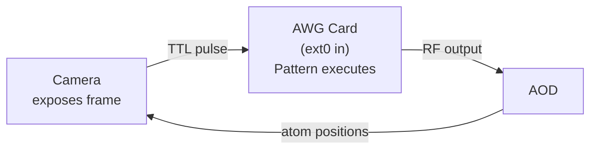
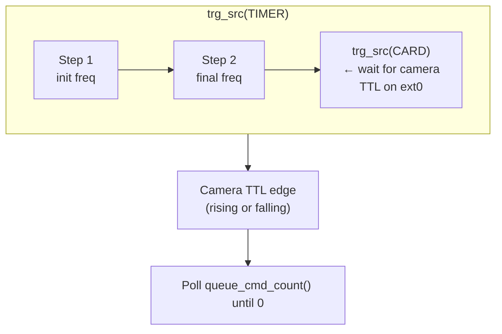
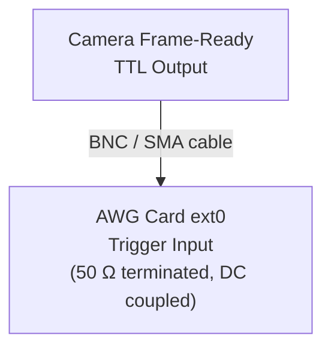

# DDS Strategy: Camera-Triggered Pattern Execution (`DDSCameraTriggeredStrategy`)

## Overview

The **camera-triggered strategy** combines the pattern approach
(spcm example 15) with external hardware triggering (spcm example 09).
A camera frame-ready TTL on the card's `ext0` input starts each
rearrangement pattern instead of `trigger.force()`.

**Based on**: spcm DDS examples 09 (external trigger) + 15 (patterns).

## How It Works

### Hardware-synced start



Pattern **start** is driven by the TTL edge. Completion is still
detected in software via `queue_cmd_count()` polling, then any remaining
travel window is slept.

### Pattern Execution Sequence



The difference from `DDSPatternStrategy`: instead of `trigger.force()`,
the card waits for a hardware TTL edge on `ext0`. Move pacing still uses
the batch travel window; `trigger_timer_s` is idle / holding only. The
camera frame period is independent of `AOD_speed`.

### External Trigger Configuration

```python
trigger = spcm.Trigger(card)
trigger.or_mask(spcm.SPC_TMASK_EXT0)          # Enable ext0 input
trigger.ext0_mode(spcm.SPC_TM_POS)            # Rising edge
trigger.ext0_level0(1.5 * spcm.units.V)       # Threshold: 1.5 V
trigger.ext0_coupling(spcm.COUPLING_DC)        # DC coupling
trigger.ext0_termination(spcm.SPCM_50OHM_ACTIVE)  # 50 Ω termination
```

## Safety limits

Two separate limits apply:

| Setting | What it controls | Limit |
|---------|------------------|-------|
| `CameraTriggerConfig.trigger_level_v` | TTL detection threshold on ext0 | Must be `< 2.0` V (constructor raises `ValueError`) |
| `HardwareConfig.max_amplitude_v` | RF output amplitude to the AOD amp | Keep `< 2.0` V (default 1.6 V) |

```python
# Accepted
strategy = DDSCameraTriggeredStrategy(
    config=CameraTriggerConfig(trigger_level_v=1.5)
)

# Rejected — raises ValueError
strategy = DDSCameraTriggeredStrategy(
    config=CameraTriggerConfig(trigger_level_v=2.0)
)
```

## Configuration

```python
from awg_controller.src.dds_strategies import (
    DDSCameraTriggeredStrategy,
    CameraTriggerConfig,
)

# Default (1.5 V threshold, rising edge, DC coupling)
strategy = DDSCameraTriggeredStrategy()

# Custom configuration
strategy = DDSCameraTriggeredStrategy(config=CameraTriggerConfig(
    trigger_level_v=1.0,              # TTL threshold (must be < 2.0 V)
    trigger_edge="rising",            # "rising" or "falling"
    trigger_coupling="DC",            # "DC" or "AC"
    trigger_termination_ohms=50.0,    # Input termination
    poll_interval_s=0.001,            # 1 ms poll interval
    poll_timeout_s=30.0,              # timeout while waiting for camera
))
```

### Using with the Controller

```python
from awg_controller.scripts.atommover_controller import (
    atommovrController, HardwareConfig, SoftwareConfig,
)

ctrl = atommovrController(
    sw_config=SoftwareConfig(...),
    hw_config=HardwareConfig(trigger_timer_s=0.2),  # idle / holding TIMER
    strategy=DDSCameraTriggeredStrategy(
        config=CameraTriggerConfig(trigger_level_v=1.0)
    ),
)
```

Or via name (default 1.5 V trigger level):

```python
ctrl = atommovrController(
    sw_config=SoftwareConfig(...),
    hw_config=HardwareConfig(),
    strategy="camera_triggered",
)
```

## Experimental checklist

- [ ] `trigger_level_v` < 2.0 V
- [ ] `max_amplitude_v` < 2.0 V in `HardwareConfig`
- [ ] Amplifier output disconnected from AOD
- [ ] Oscilloscope on amplifier output
- [ ] Camera TTL verified on oscilloscope
- [ ] TTL cable: camera → AWG card ext0

### Phase 1: Verify Camera TTL

1. Connect camera TTL output to an oscilloscope.
2. Trigger the camera and note amplitude, edge timing, and pulse width.
3. Set `trigger_level_v` to roughly half the TTL amplitude
   (e.g. 1.5 V for 3.3 V TTL), staying below 2.0 V.

### Phase 2: Verify AWG Output (No AOD)

1. Connect camera TTL to AWG ext0.
2. Connect AWG output to an oscilloscope (not the AOD).
3. Run with `max_amplitude_v = 1.0`.
4. Confirm the pattern starts on TTL, frequencies look right, and the
   card pauses between patterns.
5. Disconnect the TTL once to confirm a `poll_timeout_s` error is logged.

### Phase 3: Connect to AOD

1. Set `max_amplitude_v` to the production value (≤ 1.6 V).
2. Re-check on the oscilloscope.
3. Then connect the amplifier to the AOD.

### Troubleshooting

| Symptom | Likely Cause | Fix |
|---------|-------------|-----|
| Pattern never executes | No TTL on ext0 | Check cable / camera trigger settings |
| Timeout errors | TTL below threshold | Lower `trigger_level_v` |
| Double-triggers | Noisy TTL | DC coupling + 50 Ω termination |
| Wrong edge timing | Edge polarity mismatch | Switch `trigger_edge` |
| `ValueError` on construction | `trigger_level_v >= 2.0` | Reduce to < 2.0 V |

### Holding configuration

`send_holding()` still uses `trigger.force()` rather than waiting for a
camera TTL. Holding often runs when the camera is not imaging, so no
TTL is expected.

## Comparison with Other Strategies

| Property | Streaming | Ramp | Pattern | **Camera-Triggered** |
|---|---|---|---|---|
| Trigger source | Timer | Timer | force() | **ext0 TTL** |
| Start sync | Software/timer | FPGA ramp | Software force | **Hardware TTL** |
| Completion | Sleep | Sleep | Poll | **Poll** |
| Camera sync | Manual sleep | Manual sleep | Software | **Hardware start** |
| FIFO underrun risk | Yes | Prefill / streaming queue | No | **No** |
| Wiring required | None | None | None | **Camera → ext0** |
| Setup complexity | Low | Medium | Medium | **High** |

## spcm API Reference

```python
# DDS setup (same as pattern strategy)
dds = spcm.DDS(card, channels=channels)
dds.trg_src(spcm.SPCM_DDS_TRG_SRC_TIMER)
dds.trg_src(spcm.SPCM_DDS_TRG_SRC_CARD)
dds.exec_at_trg()
dds.write_to_card()
dds.queue_cmd_count()

# External trigger (spcm example 09)
trigger = spcm.Trigger(card)
trigger.or_mask(spcm.SPC_TMASK_EXT0)
trigger.ext0_mode(spcm.SPC_TM_POS)             # or SPC_TM_NEG
trigger.ext0_level0(1.5 * spcm.units.V)
trigger.ext0_coupling(spcm.COUPLING_DC)
trigger.ext0_termination(spcm.SPCM_50OHM_ACTIVE)
trigger.force()                                  # Used only for holding
```

## Physical Wiring



Use a short, shielded cable when practical to reduce noise-induced
false triggers.
