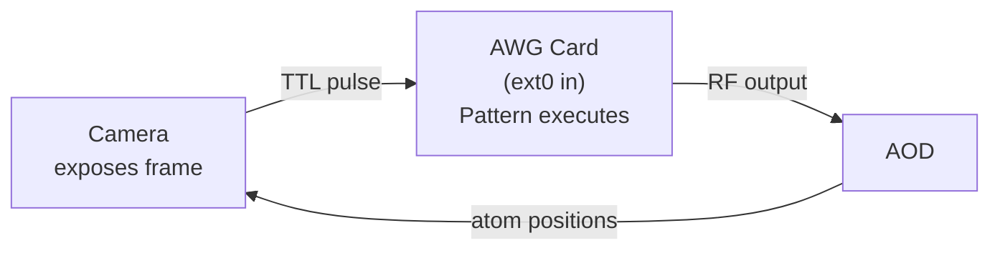
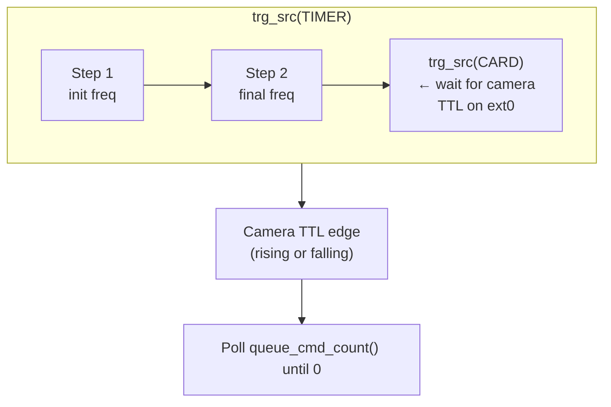
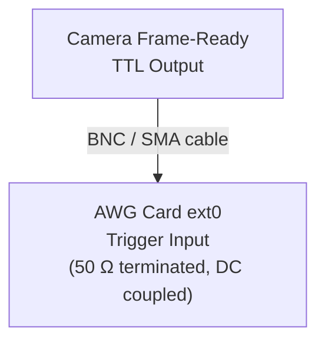

# DDS Strategy: Camera-Triggered Pattern Execution (`DDSCameraTriggeredStrategy`)

## Overview

The **camera-triggered strategy** combines the pattern-based approach
(spcm example 15) with external hardware triggering (spcm example 09)
to create a **fully hardware-synchronised** feedback loop. The camera's
frame-ready TTL pulse directly starts the next rearrangement pattern —
no software in the critical timing path.

**Based on**: spcm DDS examples 09 (external trigger) + 15 (patterns).

## How It Works

### Hardware-Synchronised Feedback Loop



### Pattern Execution Sequence



The key difference from `DDSPatternStrategy`: instead of
`trigger.force()` (software), the card waits for a **hardware TTL edge**
on the `ext0` input. This eliminates all software timing jitter from
the camera → transport path.

### External Trigger Configuration

```python
trigger = spcm.Trigger(card)
trigger.or_mask(spcm.SPC_TMASK_EXT0)          # Enable ext0 input
trigger.ext0_mode(spcm.SPC_TM_POS)            # Rising edge
trigger.ext0_level0(1.5 * spcm.units.V)       # Threshold: 1.5 V
trigger.ext0_coupling(spcm.COUPLING_DC)        # DC coupling
trigger.ext0_termination(spcm.SPCM_50OHM_ACTIVE)  # 50 Ω termination
```

## ⚠️ DANGER: Voltage Safety

### 🔴 CRITICAL: Trigger Level MUST Be Below 2.0 V

> **`trigger_level_v` is hard-limited to < 2.0 V in the constructor.**
>
> Setting `trigger_level_v >= 2.0` will raise a `ValueError` immediately.
> This is a safety interlock — **it cannot be bypassed**.
>
> **Exceeding 2.0 V on the trigger input or output amplifier will
> permanently damage the AOD driver.**

```python
# ✅ SAFE — will work
strategy = DDSCameraTriggeredStrategy(
    config=CameraTriggerConfig(trigger_level_v=1.5)
)

# ❌ UNSAFE — raises ValueError immediately
strategy = DDSCameraTriggeredStrategy(
    config=CameraTriggerConfig(trigger_level_v=2.0)  # REJECTED!
)
```

### Output Amplitude Limit

> **`HardwareConfig.max_amplitude_v` MUST be below 2.0 V.**
>
> The default is 1.6 V. **NEVER increase this without verifying
> amplifier output on an oscilloscope first.**

## Configuration

```python
from awg_controller.src.dds_strategies import (
    DDSCameraTriggeredStrategy,
    CameraTriggerConfig,
)

# Default (1.5 V threshold, rising edge, DC coupling)
strategy = DDSCameraTriggeredStrategy()

# Custom configuration
strategy = DDSCameraTriggeredStrategy(config=CameraTriggerConfig(
    trigger_level_v=1.0,              # TTL threshold (MUST be < 2.0 V)
    trigger_edge="rising",            # "rising" or "falling"
    trigger_coupling="DC",            # "DC" or "AC"
    trigger_termination_ohms=50.0,    # Input termination
    poll_interval_s=0.001,            # 1 ms poll interval
    poll_timeout_s=30.0,              # 30 s timeout (camera may be slow)
))
```

### Using with the Controller

```python
from atommovr_controller import atommovrController, HardwareConfig, SoftwareConfig

ctrl = atommovrController(
    sw_config=SoftwareConfig(...),
    hw_config=HardwareConfig(trigger_timer_s=0.2),
    strategy=DDSCameraTriggeredStrategy(
        config=CameraTriggerConfig(trigger_level_v=1.0)
    ),
)
```

Or via name (uses default 1.5 V trigger level):

```python
ctrl = atommovrController(
    sw_config=SoftwareConfig(...),
    hw_config=HardwareConfig(),
    strategy="camera_triggered",
)
```

## ⚠️ Safety Instructions for Experimental Testing

### Pre-Flight Checklist

- [ ] `trigger_level_v` < 2.0 V in the configuration
- [ ] `max_amplitude_v` < 2.0 V in `HardwareConfig`
- [ ] Amplifier output **disconnected** from AOD
- [ ] Oscilloscope connected to amplifier output
- [ ] Camera TTL output verified with oscilloscope
- [ ] TTL cable connected: camera → AWG card ext0

### Step-by-Step Testing Procedure

#### Phase 1: Verify Camera TTL Signal

1. Connect camera TTL output to oscilloscope.
2. Trigger the camera and verify:
   - TTL amplitude (should be 3.3 V or 5 V standard TTL).
   - Edge timing relative to frame exposure.
   - Pulse width and repetition rate.
3. **Record the TTL amplitude** — you need this to set `trigger_level_v`.
4. Set `trigger_level_v` to approximately **half** the TTL amplitude
   (e.g., 1.5 V for 3.3 V TTL), but **NEVER above 2.0 V**.

#### Phase 2: Verify AWG Output (No AOD)

1. Connect camera TTL to AWG card ext0 input.
2. Connect AWG output to oscilloscope (**NOT to the AOD**).
3. Run the controller with `max_amplitude_v = 1.0` (conservative).
4. Verify:
   - Pattern executes when camera TTL fires.
   - Frequency transitions occur at expected times.
   - Output amplitude stays within safe limits.
   - Card properly pauses between patterns waiting for next TTL.
5. Test `poll_timeout_s` by disconnecting the camera TTL.
   The strategy should log a timeout error after `poll_timeout_s`.

#### Phase 3: Connect to AOD

1. Set `max_amplitude_v` to production value (≤ 1.6 V).
2. Re-verify on oscilloscope.
3. **Only then** connect amplifier output to AOD.
4. Monitor AOD response during first rearrangement cycles.

### Troubleshooting

| Symptom | Likely Cause | Fix |
|---------|-------------|-----|
| Pattern never executes | No TTL signal on ext0 | Check cable, camera trigger settings |
| Timeout errors | TTL level below threshold | Lower `trigger_level_v` |
| Double-triggers | Noisy TTL signal | Use DC coupling, add 50 Ω termination |
| Pattern executes but wrong timing | Edge polarity mismatch | Switch `trigger_edge` |
| `ValueError` on construction | `trigger_level_v >= 2.0` | Reduce to < 2.0 V |

### Holding Configuration Note

The `send_holding()` method uses `trigger.force()` (software trigger)
instead of waiting for a camera TTL. This is intentional — when sending
a holding configuration between rounds, the camera may not be imaging,
so no TTL pulse is expected.

## Comparison with Other Strategies

| Property | Streaming | Ramp | Pattern | **Camera-Triggered** |
|---|---|---|---|---|
| Trigger source | Timer | Timer | force() | **ext0 TTL** |
| Software jitter | Timer-paced | FPGA-driven | Polled | **Zero** |
| Camera sync | Manual sleep | Manual sleep | Software | **Hardware** |
| FIFO underrun risk | Yes | Yes | No | **No** |
| Wiring required | None | None | None | **Camera → ext0** |
| Setup complexity | Low | Medium | Medium | **High** |
| Experimental value | Baseline | Transport quality | Reliability | **Timing precision** |

## spcm API Reference

spcm calls used by this strategy:

```python
# DDS setup (same as pattern strategy)
dds = spcm.DDS(card, channels=channels)
dds.trg_src(spcm.SPCM_DDS_TRG_SRC_TIMER)
dds.trg_src(spcm.SPCM_DDS_TRG_SRC_CARD)
dds.exec_at_trg()
dds.write_to_card()
dds.queue_cmd_count()

# External trigger (spcm example 09)
trigger = spcm.Trigger(card)
trigger.or_mask(spcm.SPC_TMASK_EXT0)
trigger.ext0_mode(spcm.SPC_TM_POS)             # or SPC_TM_NEG
trigger.ext0_level0(1.5 * spcm.units.V)
trigger.ext0_coupling(spcm.COUPLING_DC)
trigger.ext0_termination(spcm.SPCM_50OHM_ACTIVE)
trigger.force()                                  # Used only for holding
```

## Physical Wiring



Ensure the cable is properly shielded to prevent noise-induced
false triggers. Use a short cable (< 1 m) for best signal integrity.
