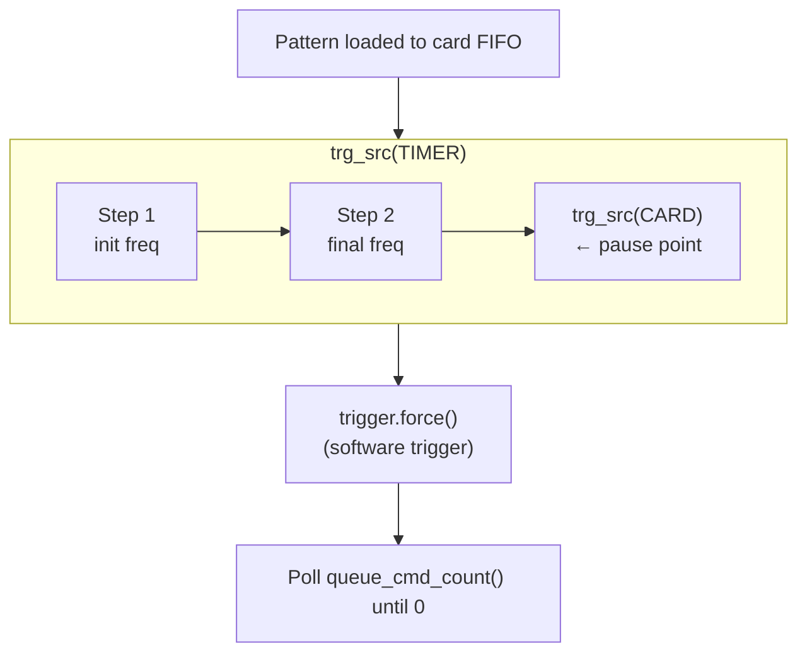

# DDS Strategy: Pattern-Based Execution (`DDSPatternStrategy`)

## Overview

The **pattern strategy** pre-loads a complete move sequence to the card
and uses the card's trigger engine to synchronise execution. This
avoids the continuous FIFO streaming loop and its underrun risk.

**Based on**: spcm DDS example 15 (repeated patterns).

## How It Works

### Pattern Execution Sequence



1. **Set `trg_src(TIMER)`**: Inter-step transitions are paced by the
   travel window (`AWGBatch.total_duration_s`).
   `HardwareConfig.trigger_timer_s` is idle / holding only.
2. **Load initial frequencies** → `exec_at_trg()`.
3. **Load final frequencies** → `exec_at_trg()`.
4. **Switch to `trg_src(CARD)`** → `exec_at_trg()`. This creates a
   pause point — the card will not advance past this command until
   it receives a card-level trigger.
5. **`write_to_card()`**: Flush all queued commands.
6. **`trigger.force()`**: Software-trigger starts the pattern.
7. **Poll `queue_cmd_count()`**: Wait until all commands have executed,
   then sleep any remaining travel window.

### Key Difference from Streaming

| Aspect | Streaming | Pattern |
|--------|-----------|---------|
| Command flow | Continuous FIFO refill | Pre-load, then trigger |
| Underrun risk | Yes (buffer starvation) | No (pre-loaded) |
| Completion detection | Sleep timer | `queue_cmd_count()` poll |
| Inter-batch sync | Implicit (timer) | Explicit (CARD trigger) |

### DDS Object Type

This strategy uses `spcm.DDS` (not `DDSCommandQueue`), matching
spcm example 15. The `DDS` class provides the `queue_cmd_count()`
method needed for completion polling.

## Configuration

```python
from awg_controller.src.dds_strategies import DDSPatternStrategy, PatternConfig

# Default configuration (poll_interval_s=0.001, poll_timeout_s=10.0)
strategy = DDSPatternStrategy()

# Custom polling
strategy = DDSPatternStrategy(config=PatternConfig(
    poll_interval_s=0.005,   # 5 ms between polls
    poll_timeout_s=15.0,     # 15 s timeout
))
```

### Using with the Controller

```python
from awg_controller.scripts.atommover_controller import (
    atommovrController, HardwareConfig, SoftwareConfig,
)

ctrl = atommovrController(
    sw_config=SoftwareConfig(...),
    hw_config=HardwareConfig(trigger_timer_s=0.2),  # idle / holding TIMER
    strategy="pattern",
)
```

## Voltage limits

> Output amplitude must stay below 2.0 V.
> `HardwareConfig.max_amplitude_v` defaults to 1.6 V.
> Exceeding 2.0 V can damage the AOD amplifier.

### Before Connecting to the AOD

1. Start with the amplifier output disconnected from the AOD.
2. Run the controller with the pattern strategy.
3. Connect an oscilloscope to the amplifier output.
4. Verify peak voltage, clean frequency transitions, and that the card
   pauses between patterns.
5. Only after verification, connect the amplifier to the AOD.

### Pattern-specific notes

- **Poll timeout**: If `queue_cmd_count()` never reaches 0, the pattern
  is stuck. The strategy logs an error after `poll_timeout_s`.
- **Trigger engine**: Configured with `or_mask(SPC_TM_NONE)` — external
  triggers are disabled. Only `trigger.force()` starts a pattern.
- **Card state between patterns**: The card holds the last frequency
  state while waiting at the CARD-trigger pause point.

### Testing procedure

1. Set `HardwareConfig.max_amplitude_v = 1.0` (conservative start).
2. Run a single-move test and verify on an oscilloscope.
3. Confirm `queue_cmd_count()` reaches 0 after each pattern.
4. Test multiple sequential patterns (multi-batch round).
5. Compare the waveform with streaming if you need equivalence.
6. Increase amplitude toward the production value (≤ 1.6 V).

## Comparison with Other Strategies

| Property | Streaming | Ramp | **Pattern** | Camera-Triggered |
|---|---|---|---|---|
| Frequency transitions | Abrupt hop | Smooth sweep | **Abrupt hop** | Abrupt hop |
| FIFO underrun risk | Yes | Prefill / streaming queue | **No** | No |
| Completion detection | Sleep timer | Sleep timer | **Polling** | Polling |
| Inter-batch sync | Implicit | Implicit | **Explicit (CARD)** | Explicit (ext0) |
| DDS class | DDSCommandQueue | DDSCommandQueue | **DDS** | DDS |
| Complexity | Low | Medium | **Medium** | High |

## spcm API Reference

```python
dds = spcm.DDS(card, channels=channels)       # Not DDSCommandQueue
dds.trg_src(spcm.SPCM_DDS_TRG_SRC_TIMER)      # Timer pacing
dds.trg_src(spcm.SPCM_DDS_TRG_SRC_CARD)       # Card trigger (pause)
dds.exec_at_trg()                               # Queue command
dds.write_to_card()                             # Flush buffer
dds.queue_cmd_count()                           # Commands remaining

trigger = spcm.Trigger(card)
trigger.or_mask(spcm.SPC_TM_NONE)              # Disable external triggers
trigger.force()                                 # Software force-trigger
```
