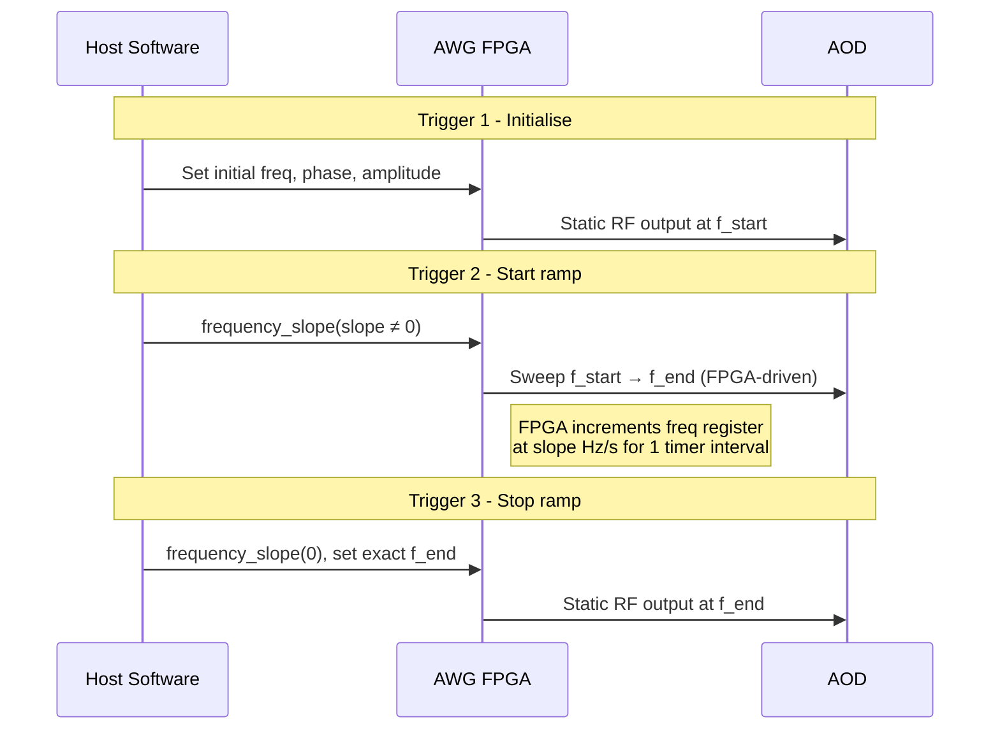

# DDS Strategy: Hardware Frequency Ramps (`DDSRampStrategy`)

## Overview

The **ramp strategy** uses the FPGA's `frequency_slope()` register to
sweep DDS core frequencies at a computed rate (Hz/s). Instead of the
abrupt hops used by streaming, the FPGA interpolates between start and
end frequencies over the travel window.

**Based on**: spcm DDS examples 03, 04, and 12.

## How It Works

### Linear Ramp (3 trigger events per move batch)



1. **Trigger 1**: Set initial frequencies, phases, and amplitudes for all cores.
2. **Trigger 2**: Activate `frequency_slope(slope)` on each core. The FPGA
   begins incrementing the frequency register at `slope` Hz/s.
3. **Trigger 3**: Set `frequency_slope(0)` to stop ramping, then set the
   exact final frequency to avoid accumulated rounding errors.

The ramp duration equals the batch travel window
(`AWGBatch.total_duration_s` from `atommovr.utils.timing.travel_duration_s`).
`HardwareConfig.trigger_timer_s` is the idle / holding TIMER only.

Host wait for a linear ramp is `3 × total_duration_s` (one TIMER period
per trigger event). Only the middle interval is the transport sweep.

### Slope Computation

```
slope = (f_end − f_start) / total_duration_s
```

For a static tone (no motion): `slope = 0`.

### S-Curve Ramp (piecewise-linear cosine profile)

When `use_scurve=True`, the linear ramp is replaced by a piecewise-linear
approximation of a raised-cosine profile:

```
f(t) = f_start + Δf · (1 − cos(π · t / T)) / 2
```

This softens acceleration and deceleration relative to a constant slope.
The profile is divided into `scurve_segments` linear segments
(default: 16), each with its own slope value.

**Trigger events**: 1 (init) + N (segments) + 1 (final) = N + 2 total.
Host wait is `(N + 2) × (total_duration_s / N)`.

## Configuration

```python
from awg_controller.src.dds_strategies import DDSRampStrategy, RampConfig

# Linear ramp (default)
strategy = DDSRampStrategy()

# S-curve ramp
strategy = DDSRampStrategy(config=RampConfig(
    ramp_stepsize=1000,    # Clock cycles between FPGA freq updates
    use_scurve=True,       # Enable cosine S-curve profile
    scurve_segments=16,    # Number of piecewise-linear segments
))
```

### Using with the Controller

```python
from awg_controller.scripts.atommover_controller import (
    atommovrController, HardwareConfig, SoftwareConfig,
)

ctrl = atommovrController(
    sw_config=SoftwareConfig(...),
    hw_config=HardwareConfig(trigger_timer_s=0.1),  # idle / holding TIMER
    strategy="ramp",
)
```

Or with S-curve:

```python
ctrl = atommovrController(
    sw_config=SoftwareConfig(...),
    hw_config=HardwareConfig(trigger_timer_s=0.1),
    strategy=DDSRampStrategy(config=RampConfig(use_scurve=True)),
)
```

## Voltage limits

> Output amplitude must stay below 2.0 V.
> `HardwareConfig.max_amplitude_v` defaults to 1.6 V.
> Exceeding 2.0 V can damage the AOD amplifier.

### Before Connecting to the AOD

1. Start with the amplifier output disconnected from the AOD.
2. Run the controller with your chosen ramp parameters.
3. Connect an oscilloscope to the amplifier output.
4. Verify peak voltage, a clean frequency sweep, and stable amplitude.
5. Only after verification, connect the amplifier to the AOD.

### Ramp-specific notes

- **Slope magnitude**: very large slopes can cause transient glitches.
  Start moderate and increase gradually.
- **Ramp stepsize**: very small values (< 100) increase FPGA update rate.
  Default of 1000 matches the spcm examples.
- **S-curve segments**: more segments → more trigger events → longer
  wall-clock wait (`(N+2)/N × travel`). Keep the total within your
  experimental window.

### Testing procedure

1. Set `HardwareConfig.max_amplitude_v = 1.0` (conservative start).
2. Use a single-core test (1×1 grid) to verify basic ramp functionality.
3. Increase to full grid and verify amplitude budget (40% per channel).
4. Switch to S-curve and check the profile on an oscilloscope.
5. Increase amplitude toward the production value (≤ 1.6 V).

## Comparison with Other Strategies

| Property | Streaming | **Ramp** | Pattern | Camera-Triggered |
|---|---|---|---|---|
| Frequency transitions | Abrupt hop | **Smooth sweep** | Abrupt hop | Abrupt hop |
| FIFO underrun risk | Yes | Prefill / streaming queue | No | No |
| Commands per batch | 1 trigger | **3 (linear) / N+2 (S-curve)** | 3 steps | 3 steps |
| Host wait | 1 × travel | **3 × travel (linear)** | Poll + remainder | Poll + remainder |
| S-curve support | No | **Yes** | No | No |
| Complexity | Low | **Medium** | Medium | High |

## spcm API Reference

```python
dds[core].frequency_slope(slope_hz_per_s)  # Set FPGA ramp rate
dds[core].frequency_slope(0.0)             # Stop ramping
dds.freq_ramp_stepsize(1000)               # FPGA update granularity
dds[core].freq(float(f_hz))               # Set exact frequency
dds.exec_at_trg()                          # Queue for next trigger
dds.write_to_card()                        # Flush command buffer
```
