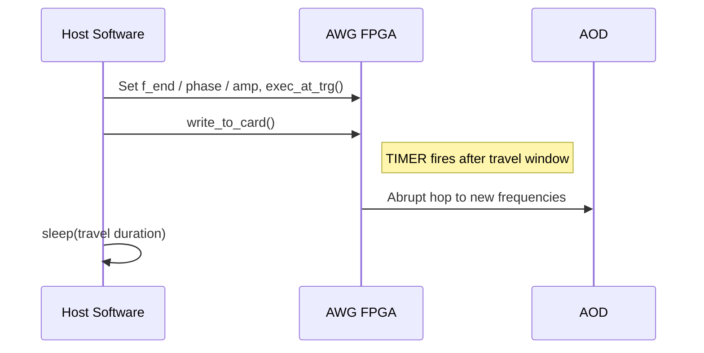

# DDS Strategy: FIFO Streaming (`DDSStreamingStrategy`)

## Overview

The **streaming strategy** is the default production approach. It uses
`DDSCommandQueue` with a TIMER trigger: each move batch is a single
frequency hop written into the card FIFO, paced by the batch travel
window.

## How It Works

### Single-hop batch



1. Program the card TIMER to `AWGBatch.total_duration_s`
   (from `atommovr.utils.timing.travel_duration_s`).
2. Write final frequencies, phases, and amplitudes for all cores.
3. `exec_at_trg()` + `write_to_card()`.
4. Sleep the travel window, then restore the idle TIMER
   (`HardwareConfig.trigger_timer_s`).

Startup also pre-fills the FIFO with idle holding writes
(`prefill_count_for_timer`) so the queue does not underrun immediately.

### Key traits

| Aspect | Behaviour |
|--------|-----------|
| Frequency transition | Abrupt hop at the trigger |
| DDS class | `spcm.DDSCommandQueue` |
| Completion | Host `sleep` for the travel window |
| Underrun risk | Yes — continuous FIFO refill required |

## Configuration

```python
from awg_controller.src.dds_strategies import DDSStreamingStrategy

strategy = DDSStreamingStrategy()
```

### Using with the Controller

```python
from awg_controller.scripts.atommover_controller import (
    atommovrController, HardwareConfig, SoftwareConfig,
)

ctrl = atommovrController(
    sw_config=SoftwareConfig(...),
    hw_config=HardwareConfig(trigger_timer_s=0.2),  # idle / holding TIMER
    strategy="streaming",
)
```

## Voltage limits

> Output amplitude must stay below 2.0 V.
> `HardwareConfig.max_amplitude_v` defaults to 1.6 V.
> Exceeding 2.0 V can damage the AOD amplifier.

Before connecting the amplifier to the AOD, verify the output on an
oscilloscope. Start with `max_amplitude_v = 1.0` and increase gradually.

## Comparison with Other Strategies

| Property | **Streaming** | Ramp | Pattern | Camera-Triggered |
|---|---|---|---|---|
| Frequency transitions | **Abrupt hop** | Smooth sweep | Abrupt hop | Abrupt hop |
| FIFO underrun risk | **Yes** | Prefill / streaming queue | No | No |
| Commands per batch | **1 trigger** | 3 (linear) / N+2 (S-curve) | 3 steps | 3 steps |
| Host wait | **1 × travel** | 3 × travel (linear) | Poll + remainder | Poll + remainder |
| DDS class | **DDSCommandQueue** | DDSCommandQueue | DDS | DDS |
| Complexity | **Low** | Medium | Medium | High |

## spcm API Reference

```python
dds = spcm.DDSCommandQueue(card, channels=channels)
dds.trg_src(spcm.SPCM_DDS_TRG_SRC_TIMER)
dds.trg_timer(duration_s)
dds[core].freq(f_hz)
dds[core].phase(phase_deg * spcm.units.deg)
dds[core].amp(amp_pct * spcm.units.percent)
dds.exec_at_trg()
dds.write_to_card()
```
